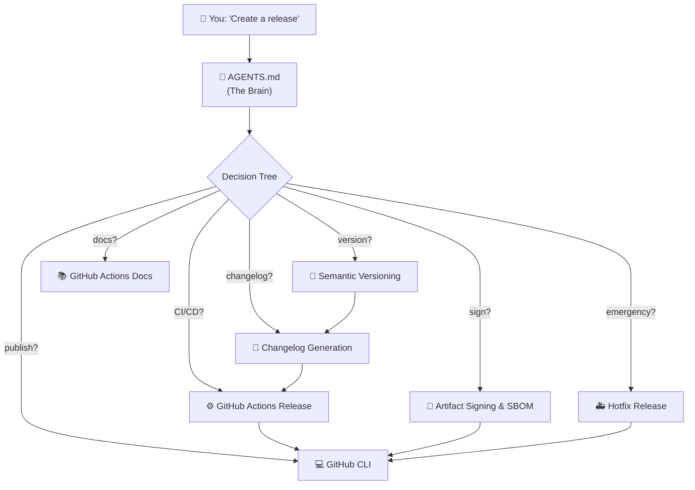
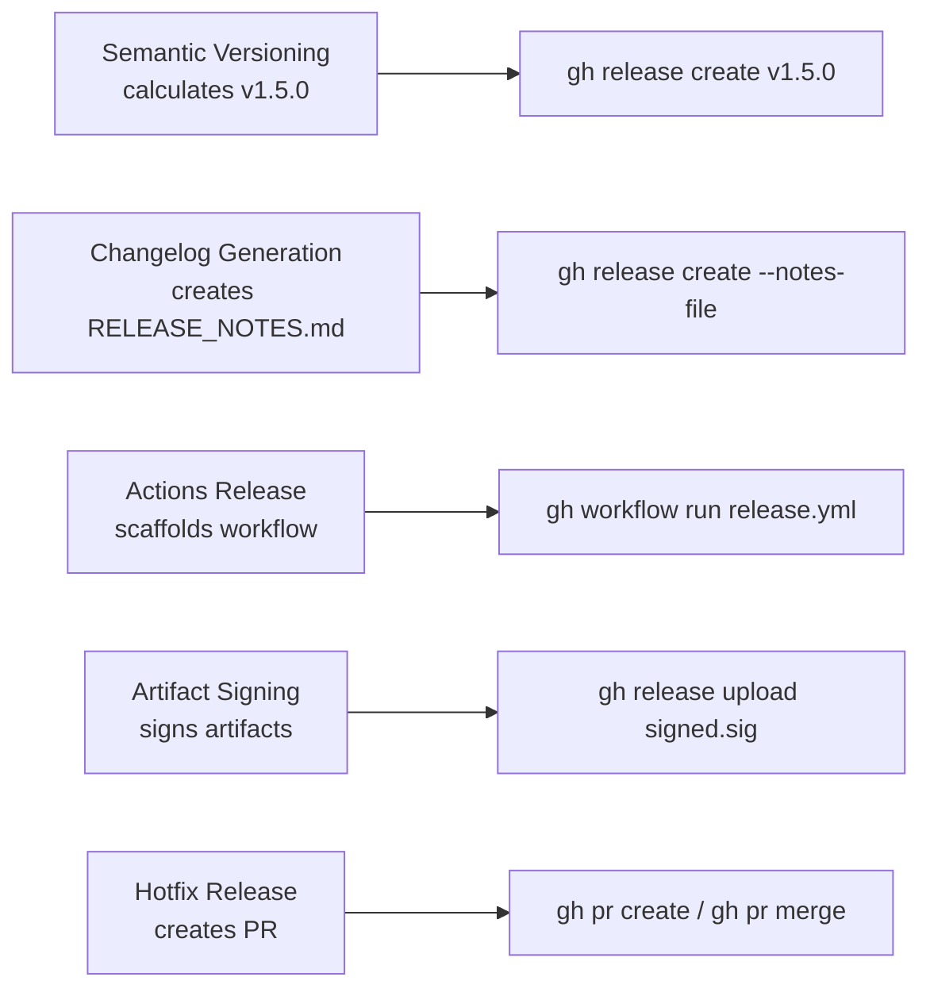
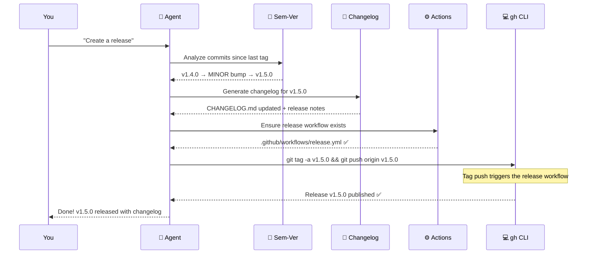

# GitHub Release Agent — Complete Explanation

## What Is This Agent?

Think of the **Release Agent** as an **automated release manager** that lives inside your code editor. When you ship software (e.g., a web app, a CLI tool, a library), there's a long list of boring-but-critical steps:

1. Figure out the next version number
2. Write release notes describing what changed
3. Create a Git tag
4. Build the code
5. Sign the build so users know it's legit
6. Publish it on GitHub
7. Deploy to staging, then production
8. If something breaks, roll out an emergency fix

**This agent automates all of that.** You just say *"create a release"* and it handles the rest by invoking the right **skills** in the right order.

---

## How the Agent Works — Architecture



### The Three Layers

| Layer | File(s) | Purpose |
|-------|---------|---------|
| **Brain** | [AGENTS.md](file:///d:/Agent/st-github-release-agent/AGENTS.md) | Identity, rules, decision tree — tells the AI *who it is* and *how to think* |
| **Skills** | `.agents/skills/*/SKILL.md` | Step-by-step instructions for specific tasks |
| **References** | `references/*.md` inside skills | Reusable YAML snippets, doc links, templates |

### How Routing Works

When you type a request, the agent reads `AGENTS.md` and follows the **decision tree**:

- *"Bump version"* → triggers `semantic-versioning` → then `changelog-generation` → then `github-actions-release`
- *"Sign my artifacts"* → triggers `artifact-signing-sbom` alone
- *"Critical bug in prod!"* → triggers `hotfix-release` alone
- *"Create a PR"* → triggers `gh-cli` alone

> [!IMPORTANT]
> **Skills have a required execution order.** Version must be calculated before changelog is generated, and changelog must exist before a release is published. The agent enforces this automatically.

---

## Skill 1: Semantic Versioning 🔢

**File:** [SKILL.md](file:///d:/Agent/st-github-release-agent/.agents/skills/semantic-versioning/SKILL.md)

### What Is Semantic Versioning?

Every software release gets a version number like **v1.4.2**. Semantic Versioning (SemVer) gives meaning to each part:

```
v MAJOR . MINOR . PATCH
  1     .  4    .  2
```

| Part | When to Increment | Meaning for Users |
|------|-------------------|-------------------|
| **MAJOR** (1 → 2) | You broke backward compatibility | ⚠️ "I might need to change my code" |
| **MINOR** (4 → 5) | You added a new feature | ✅ "New stuff, but my code still works" |
| **PATCH** (2 → 3) | You fixed a bug | ✅ "Same features, fewer bugs" |

### What Does This Skill Do?

It **reads your Git commits** and **automatically calculates** what the next version should be. No guessing, no manual counting.

### How It Works Internally

1. **Finds the last version tag** — runs `git describe --tags` to find the latest `v*` tag
2. **Collects all new commits** — runs `git log <last-tag>..HEAD`
3. **Parses each commit message** using Conventional Commits format
4. **Determines the bump** — the highest-priority change wins:
   - Any `BREAKING CHANGE` or `!` → **MAJOR**
   - Any `feat:` → **MINOR**
   - Any `fix:` → **PATCH**
   - `chore:`, `docs:`, `ci:` → no bump
5. **Updates manifest files** — `package.json`, `Cargo.toml`, `pyproject.toml`, etc.
6. **Creates an annotated Git tag** — e.g., `v1.5.0`

### Real-World Example

Imagine your app is at version **v2.3.1** and you've made these commits:

```
feat: add dark mode toggle
fix: prevent crash on empty search
fix: correct date formatting in reports
docs: update API reference
feat!: redesign the settings API
```

The skill analyzes this:
- `feat!: redesign the settings API` → has `!` → **BREAKING CHANGE** → **MAJOR** bump
- `feat: add dark mode toggle` → MINOR
- `fix:` commits → PATCH

**Highest wins** → MAJOR bump → **v2.3.1 → v3.0.0**

It also supports **pre-releases** for testing before a full release:

```
v3.0.0-alpha.1  →  v3.0.0-alpha.2  →  v3.0.0-beta.1  →  v3.0.0-rc.1  →  v3.0.0
```

---

## Skill 2: Changelog Generation 📝

**File:** [SKILL.md](file:///d:/Agent/st-github-release-agent/.agents/skills/changelog-generation/SKILL.md)

### What Is a Changelog?

A changelog is a human-readable file (`CHANGELOG.md`) that answers: **"What changed in this release?"** It's for your users, teammates, and future self.

### What Does This Skill Do?

It **reads your commits** and **generates a structured, categorized changelog** automatically — no manual writing.

### How It Works Internally

1. **Takes the version number** from the semantic-versioning skill
2. **Collects commits** between the previous tag and now
3. **Categorizes each commit** into sections based on the Conventional Commits type:

| Commit Type | Section in Changelog |
|------------|---------------------|
| `feat:` | 🚀 Features |
| `fix:` | 🐛 Bug Fixes |
| `BREAKING CHANGE` | ⚠️ Breaking Changes |
| `docs:` | 📝 Documentation |
| `perf:` | ⚡ Performance |
| `chore:`, `ci:`, `refactor:` | 🔧 Maintenance |

4. **Extracts contributor names** and maps them to GitHub usernames
5. **Generates the markdown** with links to each commit
6. **Inserts it at the top** of `CHANGELOG.md`, preserving all previous entries

### Real-World Example

After analyzing the commits from the previous example, the skill generates:

```markdown
## [3.0.0](https://github.com/your-org/app/compare/v2.3.1...v3.0.0) (2026-05-08)

### ⚠️ Breaking Changes

- **settings:** redesign the settings API ([abc1234](https://github.com/your-org/app/commit/abc1234))

### 🚀 Features

- add dark mode toggle ([def5678](https://github.com/your-org/app/commit/def5678))

### 🐛 Bug Fixes

- prevent crash on empty search ([ghi9012](https://github.com/your-org/app/commit/ghi9012))
- correct date formatting in reports ([jkl3456](https://github.com/your-org/app/commit/jkl3456))

### 📝 Documentation

- update API reference ([mno7890](https://github.com/your-org/app/commit/mno7890))

### Contributors

- @alice
- @bob
```

This gets inserted at the top of your `CHANGELOG.md` and also becomes the body of your GitHub Release.

---

## Skill 3: GitHub Actions Release ⚙️

**File:** [SKILL.md](file:///d:/Agent/st-github-release-agent/.agents/skills/github-actions-release/SKILL.md)  
**Templates:** [workflow-templates.md](file:///d:/Agent/st-github-release-agent/.agents/skills/github-actions-release/references/workflow-templates.md)

### What Is This?

GitHub Actions is GitHub's built-in CI/CD system — it runs automated tasks (build, test, deploy) whenever something happens in your repo (a push, a tag, a PR). This skill **generates the YAML workflow file** that automates your entire release pipeline.

### What Does This Skill Do?

It **auto-detects your tech stack** and **scaffolds a production-ready `release.yml`** workflow with:

- **Build step** — compiles your code
- **Test step** — runs your test suite
- **Publish step** — creates a GitHub Release with the changelog
- **Deploy staging** — deploys to a staging environment automatically
- **Deploy production** — deploys to production **with manual approval**

### How It Works Internally

1. **Detects your project type** by looking for key files:
   - `package.json` → Node.js → `npm ci && npm run build`
   - `go.mod` → Go → `go build -o bin/`
   - `Cargo.toml` → Rust → `cargo build --release`
   - `Dockerfile` → Container → `docker build`
2. **Generates the workflow YAML** with security best practices built in:
   - Triggers on tag push (`v*`) and manual dispatch
   - Adds `permissions:` block with least privilege
   - Pins all third-party Actions to full SHA hashes (not mutable `@v3` tags)
   - Generates SHA256 checksums for all artifacts
3. **Configures environments** — tells you how to set up staging/production approval gates in GitHub Settings

### Real-World Example

You say: *"Set up a release pipeline for my Node.js project"*

The skill generates `.github/workflows/release.yml` that:
1. Triggers when you push a tag like `v1.5.0`
2. Runs `npm ci && npm run build && npm test`
3. Creates a GitHub Release with your changelog as the body
4. Uploads build artifacts with SHA256 checksums
5. Deploys to staging automatically
6. Waits for a team member to approve production deployment
7. Deploys to production
8. Sends a Slack notification

The [workflow-templates.md](file:///d:/Agent/st-github-release-agent/.agents/skills/github-actions-release/references/workflow-templates.md) reference includes reusable snippets for:
- Docker builds with GHCR
- Multi-platform matrix builds (Linux/macOS/Windows, amd64/arm64)
- Slack notifications
- Rollback jobs (if production deploy fails)
- OIDC authentication for AWS/Azure/GCP (no stored credentials)

---

## Skill 4: Artifact Signing & SBOM 🔐

**File:** [SKILL.md](file:///d:/Agent/st-github-release-agent/.agents/skills/artifact-signing-sbom/SKILL.md)

### What Is Artifact Signing?

When you download software, how do you know it hasn't been tampered with? **Artifact signing** adds a cryptographic signature that proves:
- ✅ This binary was built by **this specific GitHub repo**
- ✅ It was built by **this specific CI pipeline**
- ✅ It has **not been modified** since it was built

Think of it like a wax seal on a letter — it proves authenticity and detects tampering.

### What Is an SBOM?

An **SBOM (Software Bill of Materials)** is a complete list of every library, package, and dependency your software uses. It's like the ingredients list on food packaging.

**Why does it matter?** When a vulnerability is found in a library (like the Log4j incident), an SBOM lets you instantly check: *"Does my software use that library?"*

### What Is SLSA Provenance?

**SLSA** (Supply-chain Levels for Software Artifacts) is a security framework that provides a verifiable record of *how* your software was built:
- Where was the source code?
- What build system compiled it?
- What inputs were used?
- Was the build process tamper-proof?

It has levels:
| Level | Guarantee |
|-------|-----------|
| **Level 1** | Documentation of the build process |
| **Level 2** | Build service generates provenance automatically |
| **Level 3** | Build runs on a hardened, isolated platform |

### What Does This Skill Do?

It adds three security layers to your release pipeline:
1. **Sigstore/Cosign keyless signing** — signs your artifacts using OIDC (no private keys to manage!)
2. **SBOM generation** — creates a dependency inventory using Syft or CycloneDX
3. **SLSA attestation** — adds build provenance at Level 2 or 3

### How It Works Internally

1. **Cosign keyless signing** — uses GitHub Actions' OIDC token as your identity (no GPG keys, no secrets to rotate):
   ```bash
   # For container images:
   cosign sign --yes "ghcr.io/your-org/app@sha256:abc123..."
   
   # For binary files:
   cosign sign-blob --yes --output-signature app.sig --output-certificate app.pem app
   ```
2. **SBOM generation** — scans your project and outputs a machine-readable list of all dependencies
3. **SLSA provenance** — uses `actions/attest-build-provenance` to record exactly how the build happened
4. **Adds required permissions** — `id-token: write` (for OIDC), `attestations: write` (for provenance)

### Real-World Example

Your company ships a Docker image. A customer asks: *"Can you prove this image wasn't tampered with? And what dependencies does it include?"*

With this skill configured:
```bash
# Customer verifies the signature
cosign verify ghcr.io/your-org/app:v1.5.0

# Customer checks the SBOM
gh attestation verify ./app.tar.gz --repo your-org/app

# Customer sees: "Signed by GitHub Actions, built from commit abc123 on main branch"
```

This is increasingly **required** for enterprise customers and government contracts (see [US Executive Order 14028](https://www.whitehouse.gov/briefing-room/presidential-actions/2021/05/12/executive-order-on-improving-the-nations-cybersecurity/)).

---

## Skill 5: Hotfix Release 🚑

**File:** [SKILL.md](file:///d:/Agent/st-github-release-agent/.agents/skills/hotfix-release/SKILL.md)

### What Is a Hotfix?

A **hotfix** is an emergency patch released outside the normal release cycle because something critical broke in production. Think: your login page is crashing for all users at 2 AM.

### What Does This Skill Do?

It handles the **entire emergency response lifecycle** — from branching to deploying to post-mortem — with an expedited pipeline that skips the normal staging process.

### How It Works Internally

1. **Identifies the release to patch** — finds the latest release tag (e.g., `v2.3.1`)
2. **Creates a hotfix branch** from the tag (NOT from `main`):
   ```bash
   git checkout -b hotfix/v2.3.2 v2.3.1
   ```
   > [!WARNING]
   > Branching from `main` is a common mistake! `main` may have unreleased features. The hotfix must be based on what's actually running in production.
3. **Applies the fix** — either cherry-picks an existing commit or you write the fix directly
4. **Bumps the version** — always a PATCH bump only (never MINOR or MAJOR from a hotfix)
5. **Creates an annotated tag** — `v2.3.2` with severity and fix details
6. **Runs an expedited CI pipeline** — skips staging, runs only smoke/critical tests, deploys directly to production with manual approval
7. **Back-merges to main** — so the fix isn't lost in future releases
8. **Generates a post-mortem** — a structured incident report with:
   - What happened (summary)
   - Timeline of events
   - Root cause analysis
   - Fix applied
   - Action items to prevent recurrence

### Real-World Example

**Scenario:** Friday night, your payment processing API starts returning 500 errors. You've already identified the bug — a null pointer in the payment handler introduced in `v2.3.1`.

You tell the agent: *"Critical bug — payments API is returning 500s. The fix is in commit abc123 on main."*

The agent:
1. Branches `hotfix/v2.3.2` from `v2.3.1`
2. Cherry-picks commit `abc123`
3. Bumps version to `v2.3.2`
4. Tags `v2.3.2` with the message: *"Hotfix: fix null pointer in payment handler (CRITICAL)"*
5. Triggers the hotfix CI workflow (smoke tests → production deploy with approval)
6. Merges the hotfix back into `main`
7. Generates a post-mortem document for your team's Monday retrospective

---

## Skill 6: GitHub CLI (`gh`) 💻

**File:** [SKILL.md](file:///d:/Agent/st-github-release-agent/.agents/skills/gh-cli/SKILL.md)

### What Is This?

The **GitHub CLI** (`gh`) is a command-line tool that lets you do everything you'd do on the GitHub website — but from your terminal. This skill is the **execution layer** that the other skills build on.

### What Does This Skill Do?

It's the agent's hands-on tool for interacting with GitHub. While other skills *calculate* versions and *generate* changelogs, this skill *publishes* them. It covers:

| Operation | Commands |
|-----------|----------|
| **Releases** | `gh release create/list/upload/edit/delete/download` |
| **Pull Requests** | `gh pr create/merge/review/list/checks` |
| **Issues** | `gh issue create/list/close/view` |
| **CI/CD Monitoring** | `gh run list/view/watch/rerun`, `gh workflow run` |
| **Secrets & Variables** | `gh secret set/list/delete`, `gh variable set/get` |
| **Direct API Access** | `gh api` for any GitHub API endpoint |
| **Repositories** | `gh repo clone/create/fork/view` |
| **Attestations** | `gh attestation verify/download` |

### How It Integrates With Other Skills



### Real-World Example

After the semantic-versioning and changelog-generation skills do their work:

```bash
# Publish the release with the generated changelog
gh release create v1.5.0 \
  --title "v1.5.0" \
  --notes-file RELEASE_NOTES.md \
  ./dist/*.tar.gz ./dist/*.zip

# Upload signed artifacts
gh release upload v1.5.0 ./dist/*.sig ./dist/*.pem

# Check if the release workflow passed
gh run list --workflow=release.yml --limit 3

# Watch it in real-time
gh run watch 12345
```

---

## Skill 7: GitHub Actions Docs 📚

**File:** [SKILL.md](file:///d:/Agent/st-github-release-agent/.agents/skills/github-actions-docs/SKILL.md)  
**Topic Map:** [topic-map.md](file:///d:/Agent/st-github-release-agent/.agents/skills/github-actions-docs/references/topic-map.md)

### What Is This?

This is a **documentation reference skill** — it doesn't generate code or run commands. Instead, it ensures the agent gives you **accurate, docs-grounded answers** about GitHub Actions rather than relying on potentially stale AI training data.

### What Does This Skill Do?

When you ask questions about GitHub Actions (syntax, triggers, runners, OIDC, etc.), this skill:

1. **Classifies your question** into a category (syntax, security, runners, migration, etc.)
2. **Searches official GitHub docs** at `docs.github.com/en/actions`
3. **Reads the most relevant page** before answering
4. **Provides exact doc links** — not vague references

### The Topic Map

The skill includes a [topic-map.md](file:///d:/Agent/st-github-release-agent/.agents/skills/github-actions-docs/references/topic-map.md) — a curated index of ~90 documentation pages organized by category:

| Category | Examples |
|----------|----------|
| Getting Started | Quickstart, workflow syntax, event triggers |
| Workflow Authoring | Variables, contexts, expressions, reusable workflows |
| Runners | GitHub-hosted, self-hosted, larger runners, Actions Runner Controller |
| Security | Secrets, GITHUB_TOKEN, OIDC, artifact attestations |
| Deployments | Environments, approval gates, deployment history |
| Custom Actions | JavaScript actions, composite actions, Marketplace publishing |
| Migration | From Jenkins, CircleCI, GitLab CI/CD, Travis CI |

### Real-World Example

You ask: *"How do I set up OIDC authentication for AWS in my workflow?"*

Instead of guessing, the skill:
1. Classifies → **Security & Supply Chain**
2. Finds → [Configuring OpenID Connect in Amazon Web Services](https://docs.github.com/en/actions/how-tos/secure-your-work/security-harden-deployments/oidc-in-aws)
3. Reads the page
4. Answers with the exact steps and links

---

## Supporting Files

### [.github/release.yml](file:///d:/Agent/st-github-release-agent/.github/release.yml)

This is GitHub's **auto-generated release notes configuration**. When you create a release on GitHub, it uses this file to categorize PRs by their labels:

| Label | Section in Release Notes |
|-------|-------------------------|
| `feature`, `enhancement` | 🚀 Features |
| `bug`, `fix` | 🐛 Bug Fixes |
| `breaking-change` | ⚠️ Breaking Changes |
| `security` | 🔒 Security |
| `performance` | ⚡ Performance |

It also **excludes** PRs from `dependabot` and `renovate` (automated dependency bots) and any PR labeled `ignore-for-release`.

### [VERSION](file:///d:/Agent/st-github-release-agent/VERSION)

A simple text file containing the current version: `0.1.0`. The semantic-versioning skill reads and updates this.

---

## End-to-End Example: Full Release Flow

Here's how all skills chain together when you say **"Create a release"**:



---

## Quick Reference: All Files at a Glance

| File | Purpose |
|------|---------|
| [AGENTS.md](file:///d:/Agent/st-github-release-agent/AGENTS.md) | Agent brain — identity, rules, decision tree, safety boundaries |
| [semantic-versioning/SKILL.md](file:///d:/Agent/st-github-release-agent/.agents/skills/semantic-versioning/SKILL.md) | Calculates next version from commits, creates tags |
| [changelog-generation/SKILL.md](file:///d:/Agent/st-github-release-agent/.agents/skills/changelog-generation/SKILL.md) | Generates structured CHANGELOG.md from commits |
| [github-actions-release/SKILL.md](file:///d:/Agent/st-github-release-agent/.agents/skills/github-actions-release/SKILL.md) | Scaffolds CI/CD release workflows |
| [workflow-templates.md](file:///d:/Agent/st-github-release-agent/.agents/skills/github-actions-release/references/workflow-templates.md) | Reusable YAML for Docker, multi-platform, Slack, rollback, OIDC |
| [artifact-signing-sbom/SKILL.md](file:///d:/Agent/st-github-release-agent/.agents/skills/artifact-signing-sbom/SKILL.md) | Sigstore signing, SBOM generation, SLSA provenance |
| [hotfix-release/SKILL.md](file:///d:/Agent/st-github-release-agent/.agents/skills/hotfix-release/SKILL.md) | Emergency hotfix lifecycle with post-mortem |
| [gh-cli/SKILL.md](file:///d:/Agent/st-github-release-agent/.agents/skills/gh-cli/SKILL.md) | GitHub CLI commands for releases, PRs, issues, CI |
| [github-actions-docs/SKILL.md](file:///d:/Agent/st-github-release-agent/.agents/skills/github-actions-docs/SKILL.md) | Docs-grounded answers about GitHub Actions |
| [topic-map.md](file:///d:/Agent/st-github-release-agent/.agents/skills/github-actions-docs/references/topic-map.md) | Index of ~90 official GitHub Actions doc pages |
| [.github/release.yml](file:///d:/Agent/st-github-release-agent/.github/release.yml) | GitHub auto-release-notes category configuration |
| [VERSION](file:///d:/Agent/st-github-release-agent/VERSION) | Current version number (`0.1.0`) |
